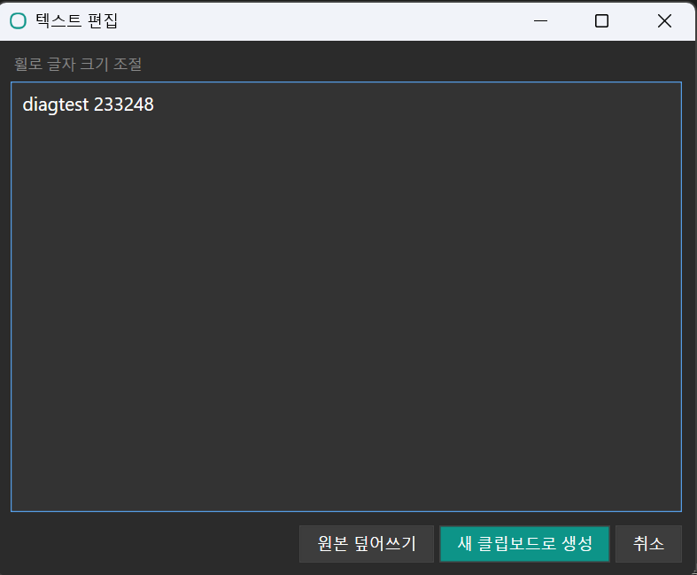
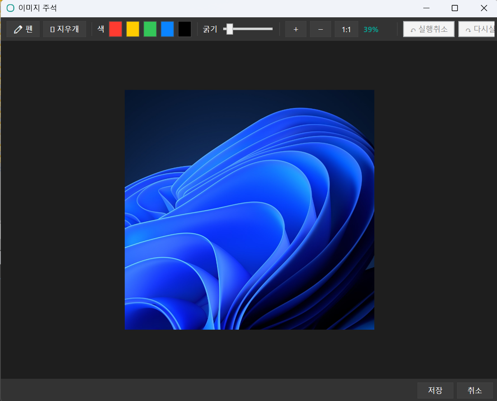

<p align="center"></p>

# FocusClip

여러 프로그램을 오가며 작업할 때 **앱 전환**과 **클립보드**를 한 번에 빠르게 다루는 Windows 트레이 유틸리티.
C# / .NET 8 / WPF로 작성, 단일 EXE로 배포된다(.NET 8 Runtime 필요).

<p align="center">
  
  &nbsp;&nbsp;
  
  &nbsp;&nbsp;
  
</p>
<p align="center"><sub>왼쪽부터 — 고정 앱 <b>사이드바</b> · <b>클립보드 팝업</b>+<b>도크</b>+<b>경로 팝업</b> · <b>설정 창</b></sub></p>

## 다운로드

[](https://github.com/praswna/FocusClip/releases/latest)

- ⬇️ **[FocusClip-Standalone.exe](https://github.com/praswna/FocusClip/releases/latest/download/FocusClip-Standalone.exe)** — .NET 설치 불필요, 단독 실행 (대부분 이걸 받으세요)
- ⬇️ **[FocusClip.exe](https://github.com/praswna/FocusClip/releases/latest/download/FocusClip.exe)** — 경량(~0.5 MB), .NET 8 Runtime 필요

> 위 링크는 항상 **최신 릴리스**를 받습니다 · 전체 버전: [Releases](https://github.com/praswna/FocusClip/releases) · Windows 10/11 x64

## 왜 만들었나

3D·그래픽 작업은 보통 한 프로그램이 아니라 **여러 CG 도구(3ds Max, Maya, Blender, Photoshop, Substance, ZBrush …)를 계속 오가며** 진행된다. 그 과정에서 생기는 두 가지 마찰을 줄이려고 만들었다.

1. **프로그램 전환** — `CapsLock` 한 번으로 등록한 프로그램들이 마우스 옆에 떠서, 클릭·숫자키로 즉시 그 창으로 점프(없으면 실행)한다. 작업 흐름을 끊지 않고 도구 사이를 이동한다.
2. **클립보드 조작** — 복사한 텍스트·이미지·파일경로를 히스토리로 모아두고, 골라서 바로 붙여넣거나 다른 앱으로 드래그한다. 매번 다시 복사할 필요가 없다.
3. **경로 분리** — 파일 경로/URL은 일반 텍스트와 성격이 다르므로 **별도 "경로" 팝업**으로 분리해 표시하고, 저장도 텍스트/이미지를 폴더로 나눠 둔다. 잡다한 텍스트에 묻히지 않는다.

## 한눈에

- **CapsLock** → 마우스 위치(있는 모니터)에 런처 도크가 뜬다. 다시 누르면 닫힌다.
- 도크 아이콘 **클릭**=해당 앱으로 전환/실행, **숫자키 1~9**=고정 구간 앱 즉시 전환, **우클릭**=설정한 동작(기본: 항상 위).
- 도크 위/아래로 **클립보드 팝업**과 **경로 팝업**, 오른쪽에 **프롬프트 팝업**이 함께 뜬다 — 항목 클릭 시 직전 창에 자동 붙여넣기.
- 멀티모니터 지원: 커서가 있는 모니터에 표시된다.

## 주요 기능

### 런처 도크
| | |
|--|--|
| 앱 전환/실행 | 아이콘 클릭 = 활성화(없으면 실행). 숫자키 `1`~`9`로 고정 구간 앱 즉시 전환 |
| 단축키 번호 배지 | 고정 구간 아이콘 좌상단에 `1`,`2`… 표시(도크·사이드바 공통) |
| 순서 변경 / 제거 | 아이콘 드래그로 순서 변경, 도크 밖으로 드래그하면 제거 |
| 고정 구간 구분선 | 숫자키·사이드바 대상이 되는 앞쪽 N개를 세로선으로 구분 |
| `+` / `✕` | `+` = 설정 열기(앱 추가), `✕` = 프로그램 종료 |
| 활성 표시등 | 실행 중(파랑)·항상 위(주황) 상태를 아이콘 하단에 표시 |

### 왼쪽 사이드바 (켜고 끌 수 있음)
화면 왼쪽 가장자리에 고정 구간 앱을 상시 표시한다. `:::` 핸들로 세로 위치 이동. 설정에서 표시 on/off.

### 클립보드 팝업
- 텍스트/이미지 최근 20개 — 기본은 **메모리에만 보관**(재시작 시 사라짐). **고정핀(📌)을 누른 항목만 파일로 저장**돼 재시작 후에도 유지된다(핀 해제하면 파일 삭제, 메모리로 복귀)
- 카드에 **날짜+시간** 표시, `전체 / 텍스트 / 이미지` 필터, 헤더 좌측 **"클립보드"** 제목
- 클릭 = 직전 창에 자동 붙여넣기, **드래그 = 다른 앱/탐색기에 직접 드롭**
- 카드별: 수정(✎) · 고정핀(📌) · 저장 위치 열기(📂) · 삭제(✕)
- **팝업 고정핀** — 켜면 CapsLock·바깥클릭에도 닫히지 않고 유지되며, **이동 핸들**로 위치를 옮길 수 있다(평소엔 도크 위 고정)
- 헤더에 저장 폴더 파일 수 표시(클릭 = 폴더 열기), 다크 테마 스크롤바
- 삭제(✕)는 목록에서만 제거 (고정해 저장된 본문 파일은 폴더에 보존 — 정리는 수동)

### 경로 팝업 (텍스트와 분리)
복사한 **파일 경로·URL**을 별도 팝업에 함축 표시(이름 + 축약 경로). `전체 / 로컬 / URL` 필터, 헤더 좌측 **"경로"** 제목. 클릭 = 경로 붙여넣기, 드래그 = 텍스트로 드롭, **고정핀(📌)**, 열기(↗) = 폴더는 지정 파일 관리자로·파일/URL은 기본 앱으로. 없는 경로는 흐리게 표시.

### 프롬프트 팝업 (자주 쓰는 문구 보관함)
클립보드 히스토리와 별개로, **자주 쓰는 프롬프트·정형 문구를 직접 등록해두는 보관함**. CapsLock 시 **클립보드 팝업 오른쪽**에 함께 뜬다(화면 우측 끝이면 왼쪽으로 뒤집힘).
- 헤더 좌측 **"프롬프트"** 제목 + **`＋` 추가 버튼**, 카드는 **제목 + 본문 미리보기**로 표시
- 카드 클릭 = 직전 창에 본문 붙여넣기, **드래그 = 텍스트로 드롭**
- 카드별: 편집(✎) · 삭제(✕) — 편집창에서 **제목·본문**을 따로 입력
- **팝업 고정핀(📌)** + 이동 핸들(다른 팝업과 동일)
- 클립보드와 달리 **전부 파일로 영구 저장**(보관함이므로) — `prompts.json`에 재시작 후에도 유지

### 편집기

<p align="center">
  
  &nbsp;&nbsp;
  
</p>

- **텍스트 편집기** — 클립 텍스트 수정(휠로 글자 크기), 「원본 덮어쓰기」/「새 클립으로」
- **이미지 편집기** — 펜/지우개(색·굵기), 휠 줌·중클릭 팬, Undo/Redo, **✂ 자르기**(드래그로 영역 선택 → 적용, 주석도 함께 잘림), 합성 후 새 클립으로 저장

### CapsLock 대소문자 인디케이터
CapsLock은 도크 단축키이자 실제 대소문자 토글이므로, 누르면 현재 상태(`A`/`a`)를 마우스 옆(도크와 같은 높이로 정렬)에 표시한다. **클릭하면 대소문자가 전환**된다.

### 기타
- **토스트 알림** — 새 클립 캡처 시 우하단 알림(이미지는 썸네일 미리보기), 드롭 실패 안내
- **시스템 트레이** 상주 — 우클릭 메뉴: 설정 / 저장 폴더 열기 / 종료
- **자동 시작** — Windows 시작 시 자동 실행(설정에서 on/off, 배포 위치가 바뀌어도 경로 자가 보정)
- **단일 인스턴스** — 실행 중 다시 실행하면 새 창 대신 도크가 열린다

## 단축키

| 키 | 동작 |
|----|------|
| `CapsLock` | 런처 도크(+팝업) 열기/닫기 — 커서가 있는 모니터에 표시 |
| `1` ~ `9` | 도크 표시 중 — 고정 구간 앱 활성화(없으면 실행) |
| `Esc` | 도크·팝업 전부 닫기(고정핀 포함) |
| 그 외 키 | 도크 자동 닫기(고정핀 팝업은 유지, 키는 대상 앱에 전달) |

기본 단축키(CapsLock)는 설정에서 변경 가능.

## 설정 (트레이 우클릭 → 설정, 또는 도크 `+`)

| 항목 | 설명 |
|------|------|
| 윈도우 시작 시 자동 실행 | HKCU Run 등록/해제 |
| 왼쪽 사이드바 표시 | 사이드바 on/off (기본 on) |
| 단축키 | 도크 단축키 키 변경 |
| 고정 개수 | 앞쪽 N개 = 숫자키·사이드바 대상 |
| 우클릭 동작 | 아이콘 우클릭 시: 항상 위 / 창 닫기 / 최소화 / 없음 |
| 폴더 열기 프로그램 | 비우면 탐색기, **Q-Dir 등 파일 관리자 지정 가능**(+ 실행 인자 템플릿 `%path%`) |
| 등록 앱 추가/제거 | 실행 중인 창 목록에서 도크에 추가/제거(드래그도 가능) |
| 📁 Config 폴더 / ☕ 후원 | 데이터 폴더 열기 / Ko-fi |

> Q-Dir에서 **새 창 대신 기존 인스턴스의 새 탭**으로 열고 싶으면, Q-Dir 자체 설정(Tools → Q-Dir as… → "Open in a new tab, in the running instance")을 켜면 된다.

## 빌드 및 배포

**개발 반복(빠른 증분 Debug 빌드 + 실행):**
```
dev.bat
```

**배포 — 두 가지 버전:**

| bat | 출력 파일 | EXE 크기 | .NET 8 Runtime |
|-----|-----------|----------|----------------|
| `build.bat` | `FocusClip.exe` | ~0.5 MB | **필요** (의존성 없음·경량) |
| `build-standalone.bat` | `FocusClip-Standalone.exe` | ~170 MB | **불필요** (의존성 포함·단일 EXE) |

이름이 달라 둘 다 `%LOCALAPPDATA%\FocusClip\app\` 에 공존한다. 일상용·자동시작 대상은 `FocusClip.exe`, .NET 없는 PC에 나눠줄 단독 실행본은 `FocusClip-Standalone.exe`.

실행 중 인스턴스 종료 → 정리 → `dotnet publish`(win-x64, ReadyToRun, 단일 EXE) → 중간 산출물 삭제 → 앱 자동 실행.

> 배포 위치는 **`%LOCALAPPDATA%\FocusClip\app\FocusClip.exe`** 다.
> ⚠️ Dropbox/OneDrive 등 **동기화 폴더 안에서 단일 EXE를 실행하면** 동기화 중 부분 상태로 실행돼 아이콘·저장이 깨질 수 있다. 그래서 소스는 동기화 폴더에 둬도 **배포는 동기화 밖(LocalAppData)** 으로 한다.

배포 전용 옵션(RID/단일EXE/R2R/self-contained)은 `csproj`가 아니라 bat 명령줄로만 전달한다 — 그래야 일반 `dotnet build`(dev)가 빠르다.

## 요구 사항
- Windows 10/11 x64
- .NET 8 Runtime (런타임 의존 배포)

## 데이터 위치

모든 데이터는 `%LOCALAPPDATA%\FocusClip\` 아래에 모인다(로컬 전용 → 드래그·열기 지연 없음). 구버전 `%APPDATA%\FocusClip` 데이터는 첫 실행 시 자동 이전.

> 클립은 기본적으로 **메모리에만** 있다. **고정핀(📌)을 누른 항목만** 아래 `clips.json`·`media\` 에 저장돼 재시작 후에도 유지된다. 고정하지 않은 클립은 파일로 남지 않는다.

| 경로 | 내용 |
|------|------|
| `config.json` | 앱 목록 · 단축키 · 각종 설정 (원자적 저장 + `config.bak` 자동 복구) |
| `prompts.json` | 프롬프트 보관함(제목+본문, 전량 영구 저장) |
| `clips.json` | **고정한** 클립 히스토리 메타데이터 |
| `media\text\` | **고정한** 텍스트·경로 클립 본문(`.txt`) |
| `media\image\` | **고정한** 이미지 클립 본문(`.png`) |
| `icons\` | 런처 앱 아이콘 PNG 캐시 |
| `app\` | 배포된 실행 파일(`FocusClip.exe`) |

## 개인정보·보안

- **기본 메모리 전용** — 클립(텍스트·이미지)은 디스크에 저장하지 않고 메모리에만 둔다. 고정핀(📌)을 누른 항목만 파일로 남으며, 나머지는 앱을 끄면 사라진다.
- **외부 통신 없음** — 텔레메트리·자동 업데이트·서버 전송이 전혀 없다(유일한 아웃바운드는 "후원" 클릭 시 브라우저로 Ko-fi 열기).
- **서드파티 의존성 없음** — 외부 NuGet 패키지 0, Microsoft .NET 런타임만 사용.
- **관리자 권한 불필요** — 일반 사용자 권한으로 동작(자동 시작은 HKCU).

## 프로젝트 구조

```
FocusClip/
├── Models/      AppConfig, AppEntry, ClipItem, PromptItem
├── Services/    ClipboardService, PromptService, HotkeyService, WindowManager, ConfigService,
│                IconService, PasteService, StartupService, FolderLauncher
├── Views/       LauncherDock, Sidebar, ClipboardPopup, PathPopup, PromptPopup, SettingsWindow,
│                TextEditWindow, PromptEditWindow, ImageAnnotateWindow, Toast, CapsIndicator
├── Interop/     NativeMethods (Win32 P/Invoke), ScreenUtil (멀티모니터)
├── Themes/      Dark.xaml
├── build.bat / dev.bat
└── App.xaml
```

## 내력

기존 **FocusManager(AutoHotkey 런처)** 와 **Clipboard-Manager(PyQt6 클립보드)** 를 하나의 네이티브 WPF 앱으로 통합한 것이다. 폴링·프로세스 간 충돌·깜빡임을 없애고, 저수준 키보드 후크 + `WM_CLIPBOARDUPDATE` 리스너로 더 빠르고 가볍게 동작한다.
