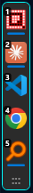
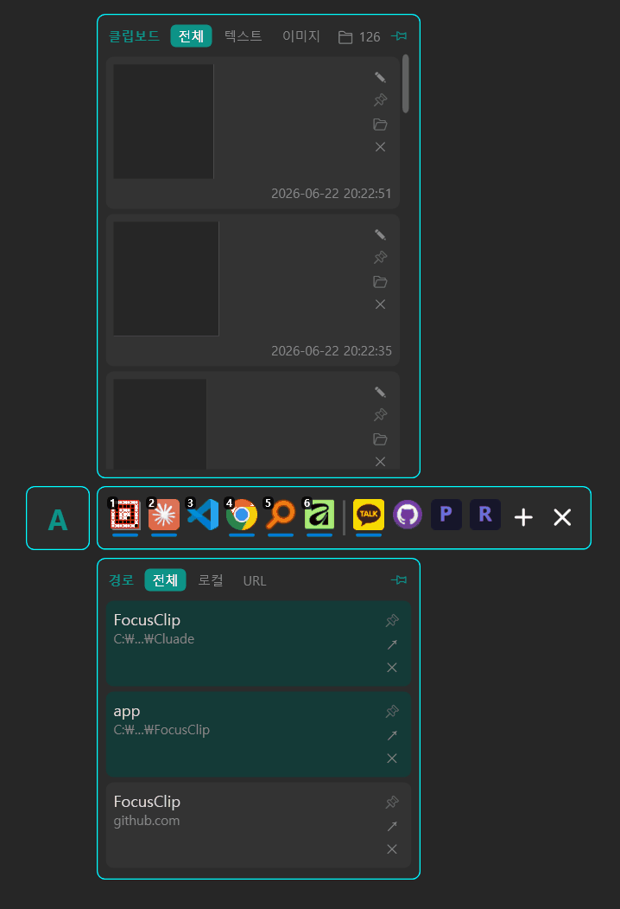
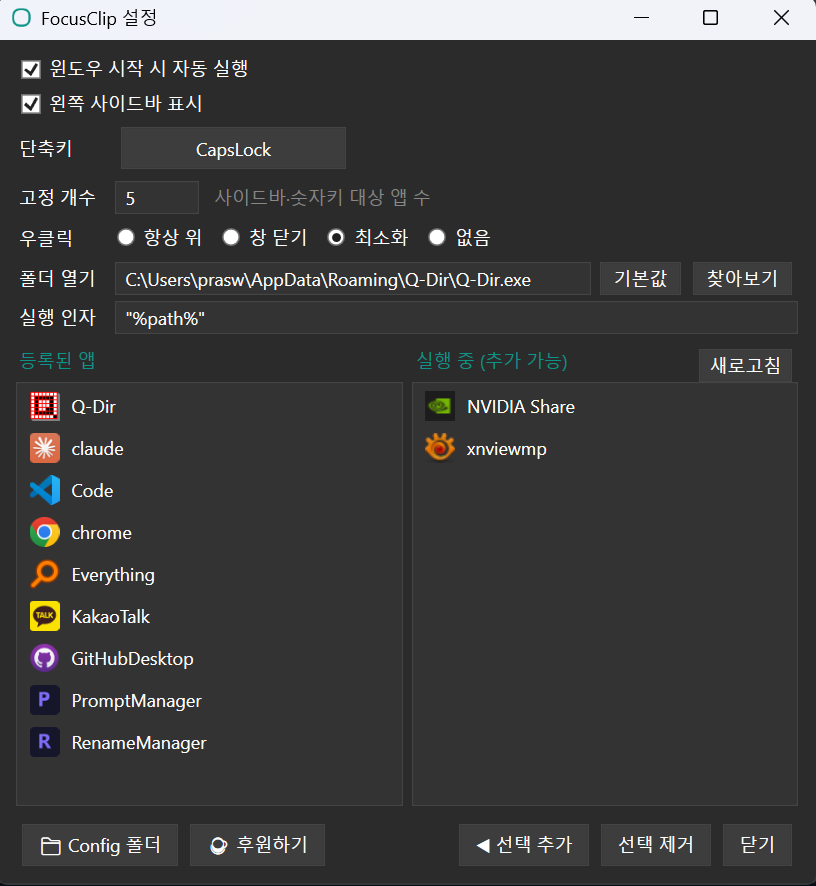

<p align="center"></p>

# FocusClip

여러 프로그램을 오가며 작업할 때 **앱 전환**과 **클립보드**를 `CapsLock` 한 번으로 빠르게 다루는 Windows 트레이 유틸리티. C# / .NET 8 / WPF.

<p align="center">
  
  &nbsp;&nbsp;
  
  &nbsp;&nbsp;
  
</p>
<p align="center"><sub>고정 앱 <b>사이드바</b> · <b>클립보드 팝업</b>+<b>도크</b>+<b>경로 팝업</b> · <b>설정 창</b></sub></p>

## 다운로드

[](https://github.com/praswna/FocusClip/releases/latest) · Windows 10/11 x64

- ⬇️ **[FocusClip-Standalone.exe](https://github.com/praswna/FocusClip/releases/latest/download/FocusClip-Standalone.exe)** — .NET 설치 불필요, 단독 실행 (대부분 이걸 받으세요)
- ⬇️ **[FocusClip.exe](https://github.com/praswna/FocusClip/releases/latest/download/FocusClip.exe)** — 경량(~0.5 MB), .NET 8 Runtime 필요

## 어떻게 쓰나

**`CapsLock`** 을 누르면 마우스 옆(커서가 있는 모니터)에 **런처 도크**가 뜨고, 그 주변에 팝업들이 함께 열린다. 다시 누르면 닫힌다.

- **도크** — 등록한 앱 아이콘. 클릭 = 전환/실행, 숫자키 `1`~`9` = 고정 구간 앱 즉시 전환, 우클릭 = 항상 위(설정에서 변경). 드래그로 순서 변경·제거.
- **클립보드 팝업**(도크 위) — 복사한 텍스트·이미지 최근 20개. 클릭 = 직전 창에 붙여넣기, 드래그 = 다른 앱에 드롭.
- **경로 팝업**(도크 아래) — 복사한 파일 경로·URL을 이름+축약 경로로 분리 표시. 열기(↗) 지원.
- **프롬프트 팝업**(클립 팝업 오른쪽) — 자주 쓰는 문구 보관함. 직접 등록하거나 클립 카드의 🔖로 승격하며, 저장 시 **그룹 이름**을 정하면 그룹마다 독립 팝업이 생긴다. 헤더 ▾로 그룹 전환, 핀(📌)한 그룹 팝업은 옮겨둔 자리가 기억된다.
- **왼쪽 사이드바** — 고정 구간 앱을 화면 가장자리에 상시 표시(설정에서 on/off).
- **편집기** — 텍스트(글자 크기) / 이미지(펜·자르기·주석) 편집 후 새 클립으로 저장.

각 팝업은 **고정핀(📌)** 으로 열어둔 채 이동할 수 있다.

## 단축키

| 키 | 동작 |
|----|------|
| `CapsLock` | 도크·팝업 열기/닫기 (설정에서 변경 가능) |
| `1` ~ `9` | 도크 표시 중 — 고정 구간 앱 활성화/실행 |
| `Esc` | 전부 닫기(고정핀 포함) |

> `CapsLock`은 대소문자 토글도 겸한다 — 누르면 현재 상태(`A`/`a`)가 마우스 옆에 뜨고, 클릭하면 전환된다.

## 저장 방식

클립은 기본적으로 **메모리에만** 있고, **고정핀(📌)을 누른 항목만 파일로 저장**돼 재시작 후에도 유지된다(프롬프트는 전량 영구 저장).

- 클립 본문(`clip_*.txt` / `clip_*.png`) → **`사진\Screenshots\`** (Win+Shift+S 스크린샷과 같은 폴더)
- 설정·기록·프롬프트·아이콘 → **`사진\Screenshots\FocusClip\`**

외부 통신·서드파티 의존성 없음, 관리자 권한 불필요.

## 빌드

```
dev.bat                 # 개발용 증분 빌드 + 실행
build.bat               # 배포: FocusClip.exe (~0.5 MB, .NET 8 필요)
build-standalone.bat    # 배포: FocusClip-Standalone.exe (~170 MB, 단독 실행)
```

배포 위치는 `%LOCALAPPDATA%\FocusClip\app\`. 배포 전용 옵션은 `csproj`가 아니라 bat 명령줄로만 전달한다(일반 `dotnet build`를 빠르게 유지).

## 내력

기존 **FocusManager(AutoHotkey 런처)** 와 **Clipboard-Manager(PyQt6 클립보드)** 를 하나의 네이티브 WPF 앱으로 통합한 것. 저수준 키보드 후크 + `WM_CLIPBOARDUPDATE` 리스너로 폴링·깜빡임 없이 동작한다.
