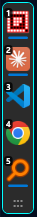
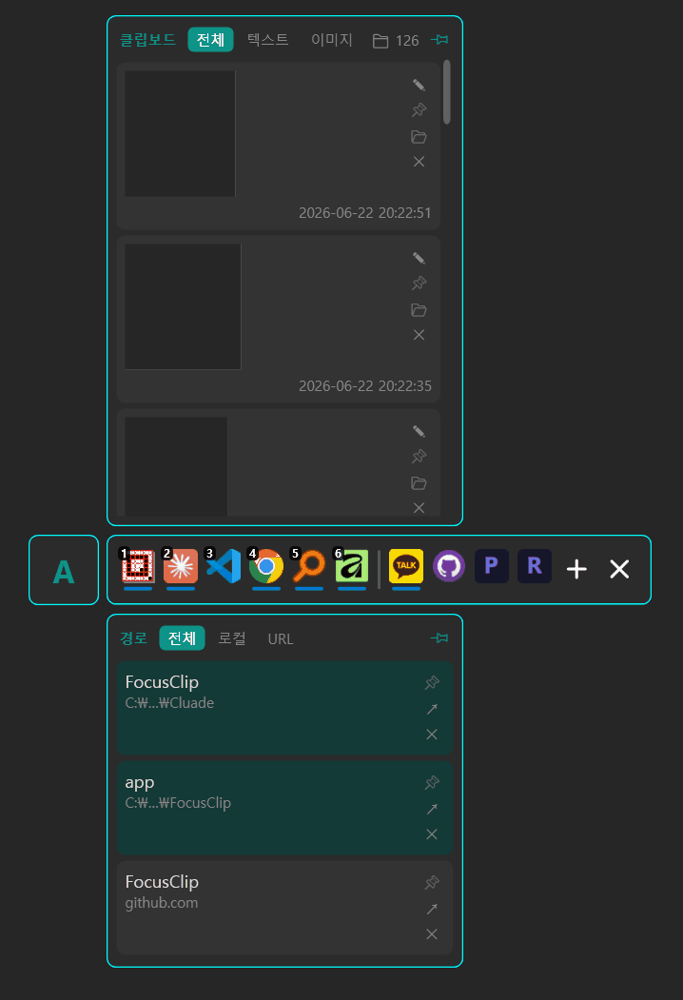
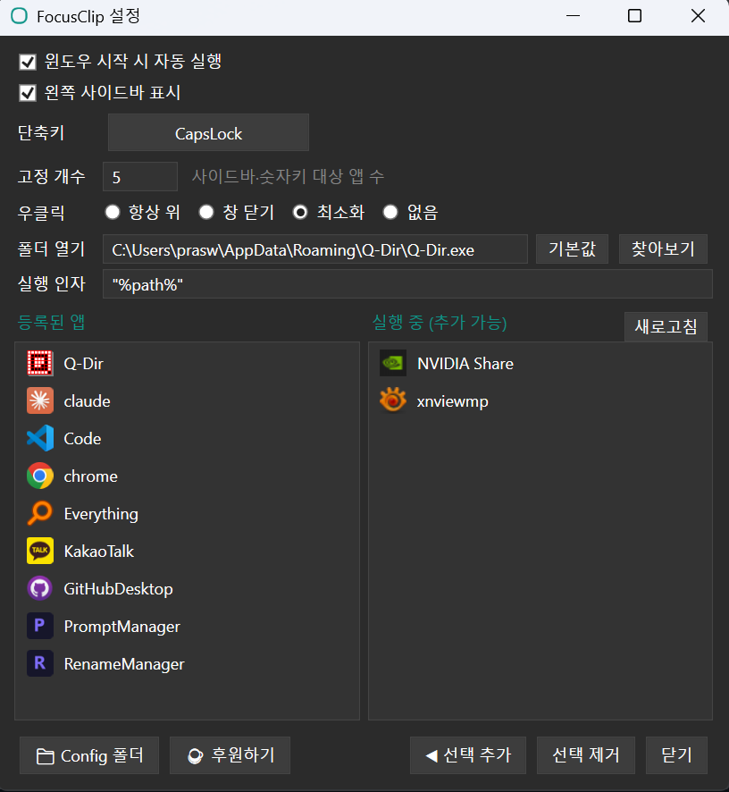

<p align="center"></p>

# FocusClip

여러 프로그램을 오가며 작업할 때 **앱 전환**과 **클립보드**를 `CapsLock` 한 번으로 빠르게 다루는 Windows 트레이 유틸리티. C# / .NET 10 / WPF.

<p align="center">
  
  &nbsp;&nbsp;
  
  &nbsp;&nbsp;
  
</p>
<p align="center"><sub>고정 앱 <b>사이드바</b> · <b>클립보드 팝업</b>+<b>도크</b>+<b>경로 팝업</b> · <b>설정 창</b></sub></p>

## 다운로드

[](https://github.com/praswna/FocusClip/releases/latest) · Windows 10/11 x64

- ⬇️ **[FocusClip-Standalone.exe](https://github.com/praswna/FocusClip/releases/latest/download/FocusClip-Standalone.exe)** — .NET 설치 불필요, 단독 실행 (대부분 이걸 받으세요)
- ⬇️ **[FocusClip.exe](https://github.com/praswna/FocusClip/releases/latest/download/FocusClip.exe)** — 경량(~0.5 MB), [.NET 10 Desktop Runtime](https://dotnet.microsoft.com/download/dotnet/10.0) 필요 (SDK 가 아니라 **Desktop** Runtime)

## 어떻게 쓰나

**`CapsLock`** 을 누르면 마우스 옆(커서가 있는 모니터)에 **런처 도크**가 뜨고, 그 주변에 팝업들이 함께 열린다. 다시 누르면 닫힌다.

- **도크** — 등록한 앱 아이콘. 클릭 = 전환/실행, 숫자키 `1`~`9` = 고정 구간 앱 즉시 전환, 우클릭 = 항상 위(설정에서 변경). 드래그로 순서 변경·제거.
- **클립보드 팝업**(도크 위) — 복사한 텍스트·이미지 최근 목록. 클릭 = 직전 창에 붙여넣기, 드래그 = 다른 앱에 드롭.
- **경로 팝업**(도크 아래) — 복사한 파일 경로·URL을 이름+축약 경로로 분리 표시. 카드 클릭은 설정에서 **열기**(폴더·파일은 탐색기, URL은 브라우저) 또는 **경로 복사**를 선택하며, 📋는 직전 창에 붙여넣기.
- **고정 팝업**(클립·경로 팝업 오른쪽) — 카드의 📌로 고정한 항목을 **클립용·경로용 각각 별도 창**에서 관리한다(클릭 동작은 기본 팝업과 동일 — 클립은 붙여넣기, 경로는 열기). 세로 위치는 클립=도크 위, 경로=도크 아래로 늘 같고, 가로로는 도크 왼쪽에 정렬돼 있다가 클립·경로가 쌓여 기본 팝업이 뜨면 그만큼 오른쪽으로 밀린다. 한 줄짜리 압축 카드라 여러 개를 고정해도 자리를 적게 먹고, 고정한 항목은 기본 팝업 목록에서 빠져 최근 항목이 밀리지 않는다.
- **프롬프트 팝업**(고정 팝업 오른쪽) — 자주 쓰는 문구 보관함. 직접 등록하거나 클립 카드의 🔖로 승격.
- **왼쪽 사이드바** — 고정 구간 앱을 화면 왼쪽 가장자리에 표시(설정에서 on/off). 기본은 **자동 숨김** — 마우스가 벗어나고 설정한 시간(기본 3초)이 지나면 화면 밖으로 미끄러져 물러나되 네온색 1px 표시선만 남고, 그 자리에 마우스를 대면 다시 나온다. 물러나 있는 동안 표시선은 클릭을 통과시키므로 화면 끝을 겨냥한 다른 앱 조작을 막지 않는다. 설정에서 자동 숨김을 끄면 상시 표시.
- **편집기** — 텍스트(글자 크기) / 이미지(펜·자르기·주석) 편집 후 새 클립으로 저장.

각 팝업은 헤더의 **고정핀(📌)** 으로 열어둔 채 이동할 수 있다(카드의 📌는 항목 고정 — 고정 팝업으로 옮겨진다).

## 단축키

| 키 | 동작 |
|----|------|
| `CapsLock` | 도크·팝업 열기/닫기 (설정에서 변경 가능) |
| `1` ~ `9` | 도크 표시 중 — 고정 구간 앱 활성화/실행 |
| `Esc` | 전부 닫기(고정핀 포함) |

> `CapsLock`은 대소문자 토글도 겸한다 — 도크 오른쪽 끝 버튼에 현재 상태(`A`/`a`)가 표시되고, 클릭하면 전환된다.

## 저장 방식

클립은 기본적으로 **메모리에만** 있고, **고정핀(📌)을 누른 항목만 파일로 저장**돼 재시작 후에도 유지된다(프롬프트는 전량 영구 저장).

- 클립 본문(`clip_*.txt` / `clip_*.png`) → **`사진\Screenshots\`** (Win+Shift+S 스크린샷과 같은 폴더)
- 설정·기록·프롬프트·아이콘 → **`사진\Screenshots\FocusClip\`**

외부 통신·서드파티 의존성 없음, 관리자 권한 불필요.

## 빌드

```
dev.bat                 # 개발용 증분 빌드 + 실행
build.bat               # 배포: FocusClip.exe (~0.5 MB, .NET 10 필요)
build-standalone.bat    # 배포: FocusClip-Standalone.exe (~170 MB, 단독 실행)
```

VS Code 는 `.vscode/launch.json` 이 들어 있어 **F5** 로 빌드·실행·디버그가 된다
(확장: `ms-dotnettools.csharp`).

빌드에는 **.NET 10 SDK**, 실행에는 **.NET 10 Desktop Runtime**(`Microsoft.WindowsDesktop.App`)이
따로 필요하다 — SDK 만으로는 빌드는 되지만 WPF 앱이 뜨지 않는다.
`dotnet --list-runtimes` 로 확인할 수 있고, `dev.bat`·`build.bat` 이 시작할 때 둘 다 검사한다.

배포 위치는 `%LOCALAPPDATA%\FocusClip\app\`. 배포 전용 옵션은 `csproj`가 아니라 bat 명령줄로만 전달한다(일반 `dotnet build`를 빠르게 유지).

## 내력

기존 **FocusManager(AutoHotkey 런처)** 와 **Clipboard-Manager(PyQt6 클립보드)** 를 하나의 네이티브 WPF 앱으로 통합한 것. 저수준 키보드 후크 + `WM_CLIPBOARDUPDATE` 리스너로 폴링·깜빡임 없이 동작한다.
